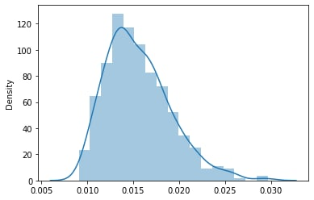
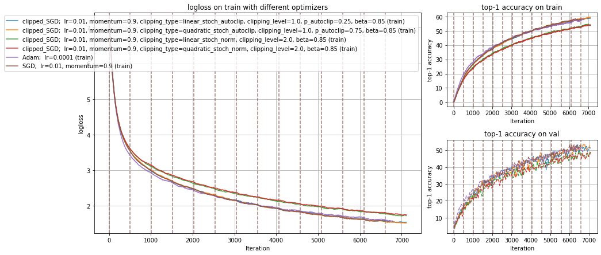
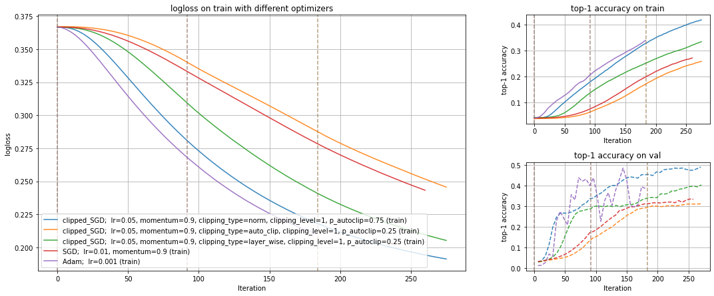
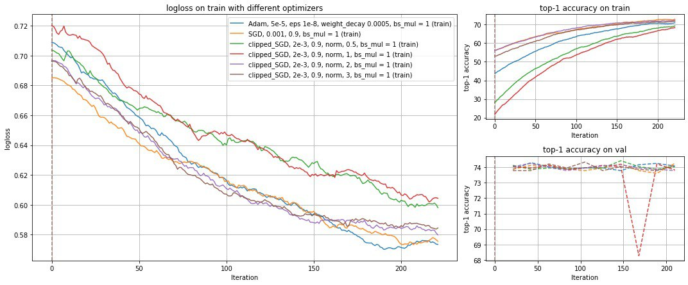
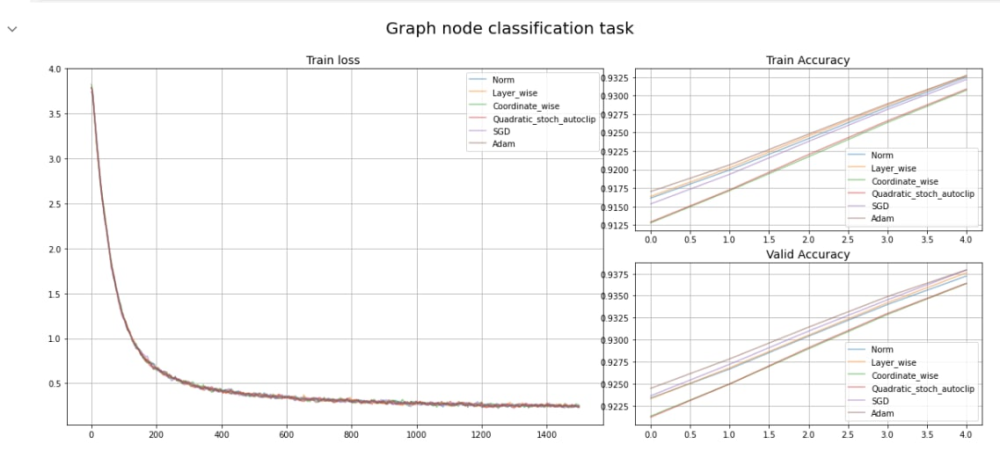

# TorchClippedOptimizers

`torch-clip` a library to improve optimization methods by clipping off heavy-tailed gradient. This makes it possible to increase the accuracy and speed of convergence during the training of neural networks on a specific number of tasks.

**Example of the distribution of gradient lengths with heavy tails:**

------------

### Installation
you can install our library using pip:  
`pip install torch-clip`  

### What do you need us for?
In the last few years, for various neural network training models (for example, BERT + CoLA), it has been found that in the case of "large stochastic gradients", it is advantageous to use special clipping (clipping/normalization) of the batched gradient. Since all modern machine learning, one way or another, ultimately boils down to stochastic optimization problems, the question of exactly how to "clip" large values of batched gradients plays a key role in the development of effective numerical training methods for a large class of models. This repository implements optimizers for the pytorch library with different clipping methods.

### Our clipping methods

+ [Norm Clipping](#NormClip)
+ [Linear Stoch Norm Clipping](#LinearStochNormClip);  
+ [Quadratic Stoch Norm Clipping](#QuadraticStochNormClip);  
+ [Layer Wise Clipping](#LayerWiseClip);  
+ [Coordinate Wise Clipping](#CoordWiseClip);  
+ [Auto Clipping](#AutoClip);  
+ [Linear Stoch Auto Clipping](#LinearStochAutoClip);  
+ [Quadratic Stoch Auto Clipping](#QuadraticStochAutoClip).

### Comparison on different tasks
We conducted a study to study the quality of our clipping methods on a number of tasks: image classification, semantic segmentation, text classification and graph-node classification.  
Image Classification on ImageNet dataset and Resnet18 model:  
 
Semantic Segmentation on PascalVOC dataset and Unet model:  
 
Text Classification on CoLA dataset and Bert model:  
 
Graph-Node classifcation on Reddit node dataset and custom GraphConv model:  
 

####  Norm Clipping
about this clipping methods
$$\alpha_{norm} = {\frac{\eta}{||\nabla f(x^k, \xi^k)||_2}}$$
-----------

####  Linear Stoch Norm Clipping
about this clipping methods
$$P(\text{clip})=\beta^{\alpha_{\text{norm}}}, \text{where}\ 0<\beta<1 \text{ and}\ \alpha = \alpha_{\text{norm}}$$
-----------

#### 	Quadratic Stoch Norm Clipping
about this clipping methods  
$$P(\text{clip})=\beta^{\alpha_{\text{norm}}^2},\text{where}\ 0<\beta<1 \text{ and}\ \alpha = \alpha_{\text{norm}}$$
-----------

#### 	Layer Wise Clipping
about this clipping methods  
$$\alpha_{\text{layer}} = \frac{\eta}{||\nabla f(x^k,\xi^k)||_2} \text{where}\ w_{layer} - \text{ weights of current layer of neural network}$$

#### 	Coordinate Wise Clipping
about this clipping methods
$$\alpha_w = \frac{\eta}{|\frac{\partial f}{\partial w}(x^k, \xi^k)|}, \text{where}\ w - \text{current model's parameter}\$$
-----------

#### 	Auto Clipping
about this clipping methods
$$\alpha_{\text{auto}} = \frac{\eta(p)}{||\nabla f(x^k,\xi^k)||_2}, \text{where}\  0 < p \leq 1 \text{ and}\ \eta(p) - \text{p-th percentile}\$$

-----------

#### 	Linear Stoch Auto Clipping
about this clipping methods  
$$P(\text{clip})=\beta^{\alpha_{\text{auto}}}, \text{where}\ 0<\beta<1 \text{ and}\ \alpha = \alpha_{\text{auto}} $$
-----------

#### 	Quadratic Stoch Auto Clipping
about this clipping methods  
$$P(\text{clip})=\beta^{\alpha_{\text{auto}}^2}, \text{where}\ 0<\beta<1 \text{ and}\ \alpha = \alpha_{\text{auto}}$$
-----------
